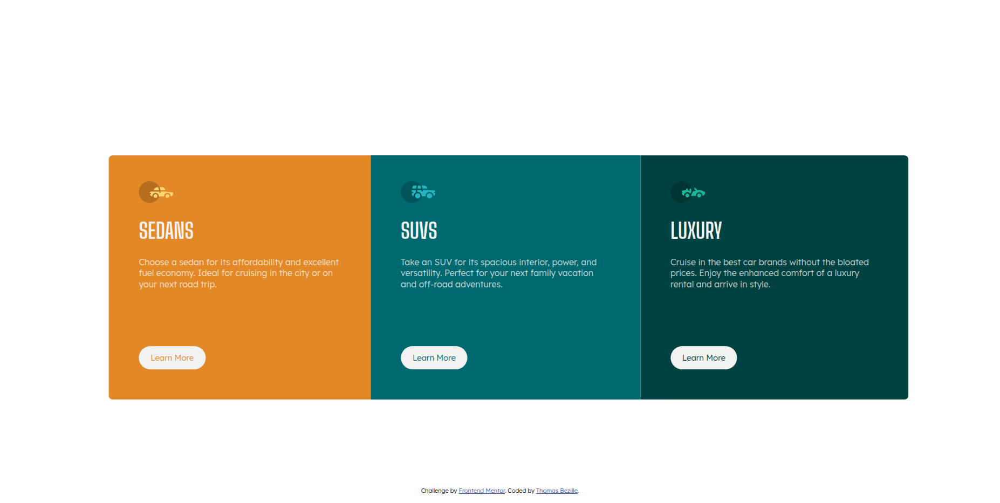
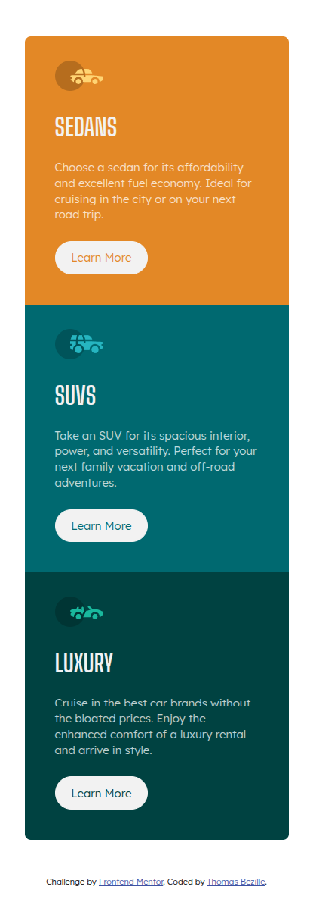

# FrontEnd-Mentor: 3-column Preview Card Component

> 3-column Preview Card Component - Challenge FrontEnd Mentor. Composant de carte à 3 colonnes responsive avec HTML5 et CSS3.

**🔗 [Demo en ligne]()**

---

## 🎯 Objectif

Cet exercice permet de consolider les bases de HTML et de CSS en utilisant FlexBox.

**Ce que j'ai appris :**

- Les layouts adaptatif avec Flexbox
- L'approche mobile-first

---

## 🛠️ Stack

---

## 👤 Contact

**Thomas Bezille** — Développeur web à Nantes

